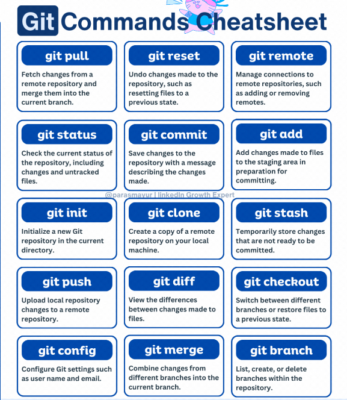

# 📚 Full Stack Software Engineering

This is the central repository for IBT Learning's Full Stack Software Engineering program.

## Author

👨‍💻 **Authors:** [Edema Ukabi](https://github.com/edemaukabi), [Danny Burrow](https://github.com/burrowdown)

👨‍💻 **Instructor:** [Edema Ukabi](https://github.com/edemaukabi)

## Support

🛠️ **Support:** [Adesoji1](https://github.com/Adesoji1)

## Tools

Git is a distributed version control system that tracks versions of files. It is often used to control source code by programmers collaboratively developing software.for more information, click [here](git-resources/gitcheatsheet.md)

## Useful links

🔗 [GitHub's git cheat sheet](https://education.github.com/git-cheat-sheet-education.pdf) (this one is more succinct)

🔗 [FreeCodeCamp's git cheat sheet](https://www.freecodecamp.org/news/git-cheat-sheet/) (this one goes into more detail)

🔗 [Markdown cheat sheet](https://www.markdownguide.org/cheat-sheet/)

🔗 [HTML Elements reference](https://developer.mozilla.org/en-US/docs/Web/HTML/Element)

🔗 [CSS Tricks Guide to Flexbox](https://css-tricks.com/snippets/css/a-guide-to-flexbox/)

🔗 [CSS Tricks Guide to CSS Grid](https://css-tricks.com/snippets/css/complete-guide-grid/)

🔗 [CSS Tricks Guide to Media Queries](https://css-tricks.com/a-complete-guide-to-css-media-queries/) (this goes much more in depth than was covered in the lesson)

🔗 [CSS Selector Reference](https://www.w3schools.com/cssref/css_selectors.php)

### Server

| Week | Topic                        | Link                                                                  |
| ---- | ---------------------------- | --------------------------------------------------------------------- |
| 17   | Using npm packages           | [Server Assignment #1](./4-server/assignments/server-assignment-1.md) |
| 17   | My First Express Server      | [Server Assignment #2](./4-server/assignments/server-assignment-2.md) |
| 18   | Getting started with Postman | [Server Assignment #3](./4-server/assignments/server-assignment-3.md) |
| 19   | Locally stored to-do list    | [Server Assignment #4](./4-server/assignments/server-assignment-4.md) |

<!--
| 20   | Cookies                      | [Server Assignment #5](./4-server/assignments/server-assignment-5.md) |

| 20   | Server Final Project         | [Server Final Project](./4-server/assignments/server-final-project.md) |
 -->

### Web APIs

| Week | Topic                                 | Link                                                                    |
| ---- | ------------------------------------- | ----------------------------------------------------------------------- |
| 14   | DOM, Query Selectors, Event Listeners | [Web API Assignment #1](./3-web-apis/assignments/web-assignment-1.md)   |
| 16   | Fetching API Data                     | [Web API Assignment #2](./3-web-apis/assignments/web-assignment-2.md)   |
| 16   | Web APIs Final Project                | [Web APIs Final Project](./3-web-apis/assignments/web-final-project.md) |

### JavaScript

| Week | Topic               | Link                                                               |
| ---- | ------------------- | ------------------------------------------------------------------ |
| 8    | Strings and Numbers | [JS Assignment #1](./2-javascript/assignments/js-assignment-1.md)  |
| 9    | Booleans            | [JS Assignment #2](./2-javascript/assignments/js-assignment-2.md)  |
| 9    | Conditionals        | [JS Assignment #3](./2-javascript/assignments/js-assignment-3.md)  |
| 10   | Loops               | [JS Assignment #4](./2-javascript/assignments/js-assignment-4.md)  |
| 11   | Functions           | [JS Assignment #5](./2-javascript/assignments/js-assignment-5.md)  |
| 12   | Objects             | [JS Assignment #6](./2-javascript/assignments/js-assignment-6.md)  |
| 12   | Classes             | [JS Assignment #7](./2-javascript/assignments/js-assignment-7.md)  |
| 13   | Callbacks           | [JS Assignment #8](./2-javascript/assignments/js-assignment-8.md)  |
| 13   | JS Final Project    | [JS Final Project](./2-javascript/assignments/js-final-project.md) |

### HTML & CSS

| Week | Topic            | Link                                                                                                        |
| ---- | ---------------- | ----------------------------------------------------------------------------------------------------------- |
| 1   | 📝 Course Introduction and Command Line Interface|
| 2    | 📝 Git and Github |
| 3    | 🌐 HTML          | [HTML Assignment #1](1-html-css/basics/assignment-1.md)                                                     |
| 4    | 🎨 CSS           | [CSS Assignment #1 (Flexbox)](1-html-css/flexbox/flexbox-assignment/css-assignment-1.md)                    |
| 5    | 🎨 CSS           | [CSS Assignment #2 (Grid)](1-html-css/grid/grid-assignment/css-assignment-2.md)                             |
| 6    | 🎨 CSS           | [CSS Assignment #3 (Responsive Design)](1-html-css/media-queries/responsive-assignment/css-assignment-3.md) |
| 7    | 🌐 HTML & 🎨 CSS | [HTML & CSS Final Project](1-html-css/blog-project.md)                                                      |
